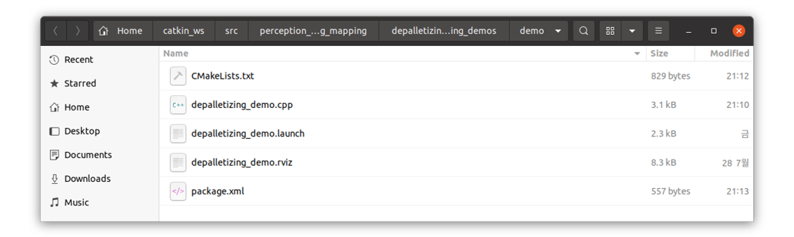
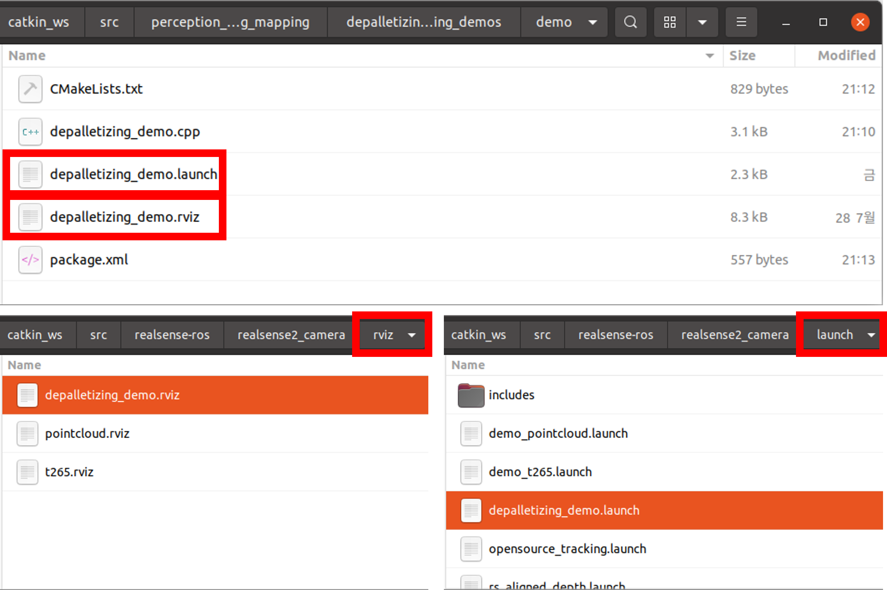
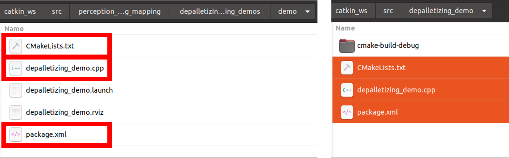
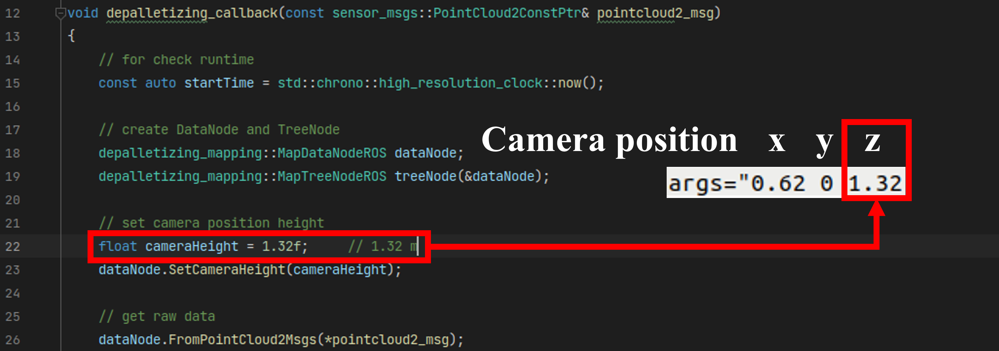

# How to run demo
Demo files are configured as shown in the figure below.  
You can find these files in this package, **perception_depalletizing_mapping/depalletizing_mapping_demos/demo/**  
or can be found at [here](https://github.com/wookjinAhn/perception_depalletizing_mapping/tree/master/depalletizing_mapping_demos/demo).


### Basic files for launch demo  
**depalletizing_demo.launch** : ros launch file. you should move or copy into launch directory at realsense-ros package.   
**depalletizing_demo.rviz** : rviz config file. you should move or copy into rviz directory at realsense-ros package.

### For demo package.
**depalletizing_demo.cpp** : main src file for run depalletizing mapping.  
**CMakeLists.txt**  
**package.xml**  


## 1. Copy .launch file and .rviz file into realsense-ros package
Copy files into each right directory.  
**depalletizing_demo.launch, depalletizing_demo.rviz**  

Follow the command below or copy the files to the appropriate directory. 

```bash
cd ~/catkin_ws/src/perception_depalletizing_mapping/depalletizing_mapping_demos/demo/

# copy depalletizing_demo.launch
cp depalletizing_demo.launch ~/catkin_ws/src/realsense-ros/realsense2_camera/launch/

# copy depalletizing_demo.rviz
cp depalletizing_demo.rviz ~/catkin_ws/src/realsense-ros/realsense2_camera/rviz/
```

If you follow the above process, you will have the same result as the figures below.



## 2. Create catkin package
```bash
cd ~/catkin_ws/demo/
catkin create pkg depalletizing_demo    
cd depalletizing_demo
clion .                                 # open CLion at package directory
```


## 3. Create and config depalletizing_demo.cpp, CMakeLists.txt, package.xml 
Copy files into your catkin package directory.  
**depalletizing_demo.cpp, CMakeLists.txt, package.xml**

Follow the command below or copy the files to the appropriate directory.

```bash
cd ~/catkin_ws/src/perception_depalletizing_mapping/depalletizing_mapping_demos/demo/

# copy depalletizing_demo.cpp, CMakeLists.txt, package.xml
cp depalletizing_demo.cpp CMakeLists.txt package.xml ~/catkin_ws/src/depalletizing_demo/
```

If you follow the above process, you will have the same result as the figures below.



## 4. Set your Camera Position infomation
You **MUST CHECK** your camera position in real world, and set that information in **.launch** file and main process **.cpp** file.  
In demo files, camera was set by x = 0.62, y = 0, z = 1.32 which unit is meter.




## 5. Build and run
```bash
# build depalletizing_demo package.
cd ~/catkin_ws/src/
catkin_make -DCMAKE_BUILD_TYPE=Release

# launch file
roslaunch realsense2_camera depalletizing_demo.launch
# run our package
rosrun depalletizing_demo depalletizing_demo
```

---

